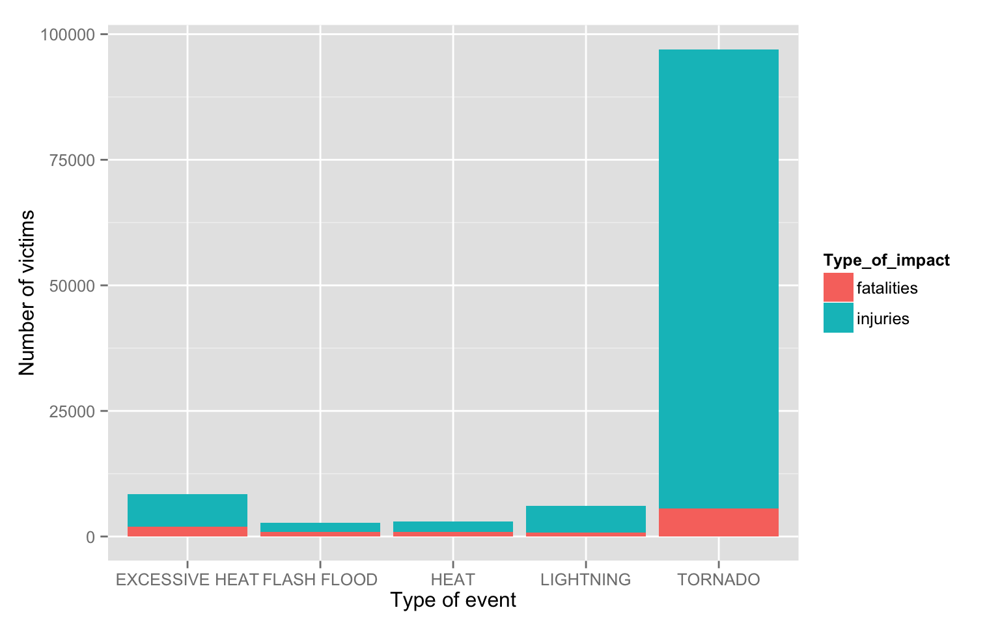

# Five most destructive natural events across the United States
DanSpiny  
26 Sep 2015  
## Synopsis

In this report we aim to describe the changes in fine particle (PM2.5) outdoor air pollution in the United States between the years 1999 and 2012. Our overall hypothesis is that out door PM2.5 has decreased on average across the U.S. due to nationwide regulatory requirements arising from the Clean Air Act. To investigate this hypothesis, we obtained PM2.5 data from the U.S. Environmental Protection Agency which is collected from monitors sited across the U.S. We specifically obtained data for the years 1999 and 2012 (the most recent complete year available). From these data, we found that, on average across the U.S., levels of PM2.5 have decreased between 1999 and 2012. At one individual monitor, we found that levels have decreased and that the variability of PM2.5 has decreased. Most individual states also experienced decreases in PM2.5, although some states saw increases.

## Data Processing


```r
library(downloader)
library(dplyr)
library(reshape2)
library(ggplot2)
```


```r
# data loading

url = "https://d396qusza40orc.cloudfront.net/repdata%2Fdata%2FStormData.csv.bz2"
if(!file.exists("RepData_PeerAssessment2")){
        dir.create("RepData_PeerAssessment2")
}

download(url, destfile = "./RepData_PeerAssessment2/StormData.csv.bz2")

storm_data <- read.csv("./RepData_PeerAssessment2/StormData.csv.bz2")
```


```r
# data preprocessing

dim(storm_data)
```

```
## [1] 902297     37
```

```r
storm_data <- select(storm_data, EVTYPE, PROPDMG, PROPDMGEXP, CROPDMG, CROPDMGEXP, FATALITIES, INJURIES)
storm_tf <- tbl_df(storm_data)
glimpse(storm_tf)
```

```
## Observations: 902297
## Variables:
## $ EVTYPE     (fctr) TORNADO, TORNADO, TORNADO, TORNADO, TORNADO, TORNA...
## $ PROPDMG    (dbl) 25.0, 2.5, 25.0, 2.5, 2.5, 2.5, 2.5, 2.5, 25.0, 25....
## $ PROPDMGEXP (fctr) K, K, K, K, K, K, K, K, K, K, M, M, K, K, K, K, K,...
## $ CROPDMG    (dbl) 0, 0, 0, 0, 0, 0, 0, 0, 0, 0, 0, 0, 0, 0, 0, 0, 0, ...
## $ CROPDMGEXP (fctr) , , , , , , , , , , , , , , , , , , , , , , , , 
## $ FATALITIES (dbl) 0, 0, 0, 0, 0, 0, 0, 0, 1, 0, 0, 0, 1, 0, 0, 4, 0, ...
## $ INJURIES   (dbl) 15, 0, 2, 2, 2, 6, 1, 0, 14, 0, 3, 3, 26, 12, 6, 50...
```

```r
table(storm_data$PROPDMGEXP)
```

```
## 
##             -      ?      +      0      1      2      3      4      5 
## 465934      1      8      5    216     25     13      4      4     28 
##      6      7      8      B      h      H      K      m      M 
##      4      5      1     40      1      6 424665      7  11330
```

```r
table(storm_data$CROPDMGEXP)
```

```
## 
##             ?      0      2      B      k      K      m      M 
## 618413      7     19      1      9     21 281832      1   1994
```

```r
multiplier <- c('K' = 1e3, 'k' = 1e3, 'M' = 1e6, 'm' = 1e3, 'B' = 1e9)
```
## Results

### Most harmful with respect to population health

```r
top_fatal <- storm_tf %>% group_by(EVTYPE) %>% summarise(n_fatal = sum(FATALITIES)) %>% arrange(desc(n_fatal))

top_inj <- storm_tf %>% group_by(EVTYPE) %>% summarise(n_inj = sum(INJURIES)) %>% arrange(desc(n_inj))

health_imp <- left_join(top_fatal, top_inj, by = "EVTYPE")

health_imp_p <- mutate(health_imp, fatal_p = n_fatal/sum(n_fatal), inj_p = n_inj/sum(n_inj))
head(health_imp_p, n = 10)
```

```
## Source: local data frame [10 x 5]
## 
##            EVTYPE n_fatal n_inj    fatal_p       inj_p
## 1         TORNADO    5633 91346 0.37193793 0.650019925
## 2  EXCESSIVE HEAT    1903  6525 0.12565203 0.046432028
## 3     FLASH FLOOD     978  1777 0.06457577 0.012645167
## 4            HEAT     937  2100 0.06186860 0.014943641
## 5       LIGHTNING     816  5230 0.05387917 0.037216782
## 6       TSTM WIND     504  6957 0.03327831 0.049506148
## 7           FLOOD     470  6789 0.03103334 0.048310657
## 8     RIP CURRENT     368   232 0.02429845 0.001650917
## 9       HIGH WIND     248  1137 0.01637504 0.008090914
## 10      AVALANCHE     224   170 0.01479036 0.001209723
```

```r
health_imp <- top_n(health_imp, 5, wt = n_fatal)

health_imp <- melt(health_imp, id.vars = c("EVTYPE"), variable.name = "Type_of_impact", value.name = "n_of_victims")

levels(health_imp$Type_of_impact) <- c("fatalities", "injuries")

ggplot(health_imp, aes(EVTYPE, n_of_victims, fill = Type_of_impact)) + geom_bar(stat = "identity") + xlab("Type of event") + ylab("Number of victims")
```

 

### Events that have the greatest economic consequences

